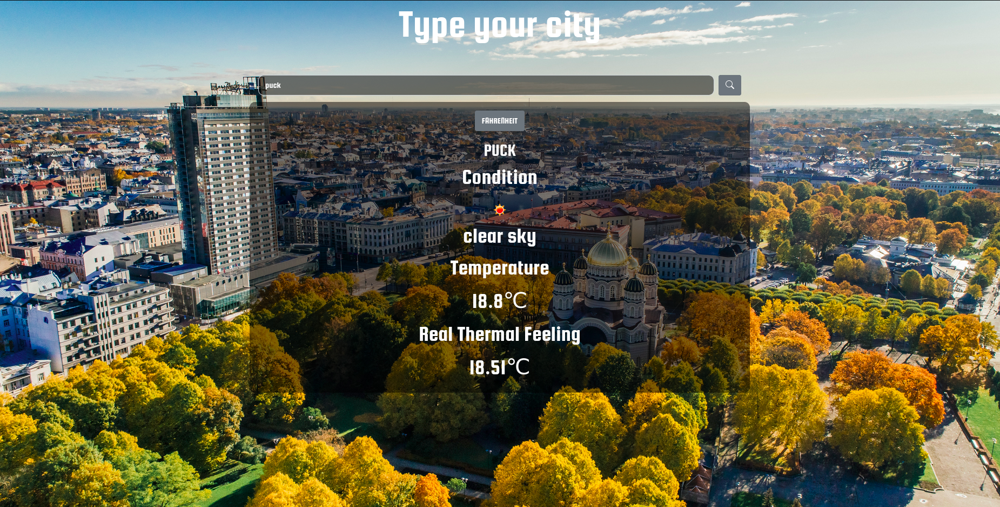

# Weather App

## Table of Contents
  <br />

* [About the Project](#about-the-project)
* [Built With](#built-with)
* [Contributing](#contributing)
* [Contact](#authors)
* [Acknowledgements](#acknowledgements) 
* [Getting Started](#getting-started) 
* [Live Demo and Video](#live-version) 

#
<br />

 <br/>
 <br/>
 <br/>
 <br/>


<br />

### Built With

* [JAVASCRIPT] [BOOTSTRAP] [WEBPACK] [BABEL] [API]

## Live Version

* [Live Demo](https://sergiocortessat.github.io/JSWeatherApp/) 

<!-- ABOUT THE PROJECT   -->
## About The Project
The Weather Web Application allows user to set different cities and check the forecast weather for the upcoming 24 hours. As such the app makes usage of API with Async to constantly render and display the most accurate information of the weather. therefore updating itself every certain time. Each person can check and set the city they wish and the weather will appear. Animations allow for the user to know the current conditions and upcoming ones for the next hours and days.

## Screenshot Test

<p align="center">
  
</p>


## Contributing

Contributions make the open-source community such an amazing place to learn, inspire, and create. Any contributions you make are **greatly appreciated**.

## Prerequisites

Terminal or similar to execute the program.


## Getting Started


## Clone project

- To get a local copy up and running follow these simple example steps.
- Clone this repository with git clone ```https://github.com/sergiocortessat/JSWeatherApp``` using your terminal or command line.
- Change to the project directory by entering: ```cd JSWeatherApp``` in the terminal.
- Enter the project folder and run locally by using npm start.
- If the project cant be build, please run npx webpack.

## Command line steps
```
- $ git clone `$ git clone https://github.com/sergiocortessat/JSWeatherApp
- $ git checkout develop
- $ cd JSWeatherApp
- $ npm start
- ##(If project doesn't build, please run): $ npx webpack
```

## Authors

👤 Sergio Cortes Satizabal

- Github: [@sergiocortessat](https://github.com/sergiocortessat)
- Twitter: [@sergiocortessat](https://twitter.com/sergiocortessat)
- LinkedIn: [@sergiocortessat](www.linkedin.com/in/sergio-cortes-satizabal-3b452194)


<!-- ACKNOWLEDGEMENTS -->
## Acknowledgements

* [Microverse](https://www.microverse.org/)


## 📝 License

This project is [MIT](https://github.com/sergiocortessat/sergiocortessat/blob/main/LICENSE) licensed.


